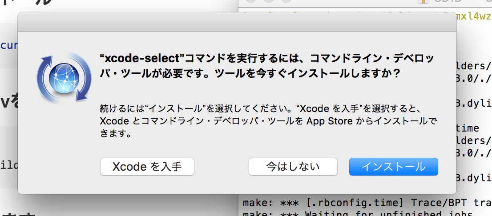
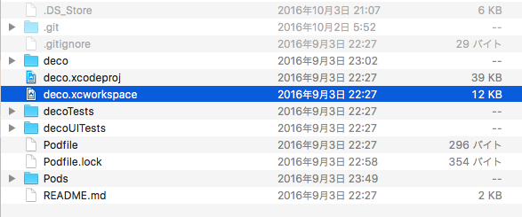
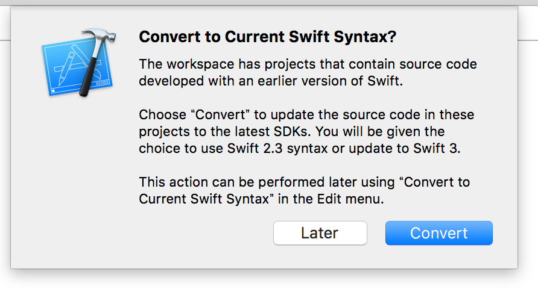
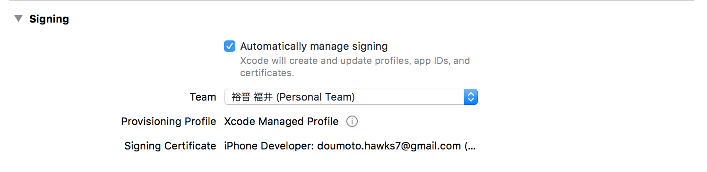
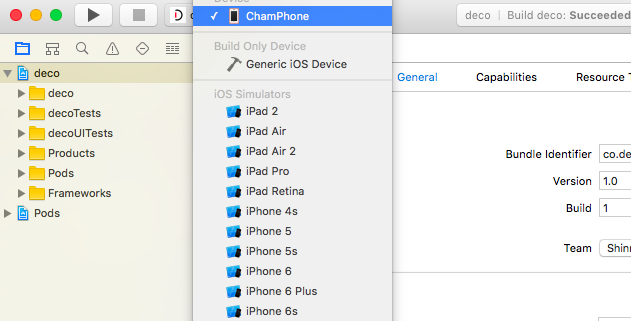
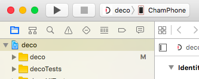
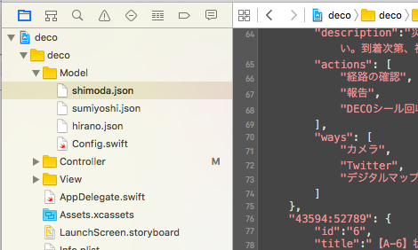
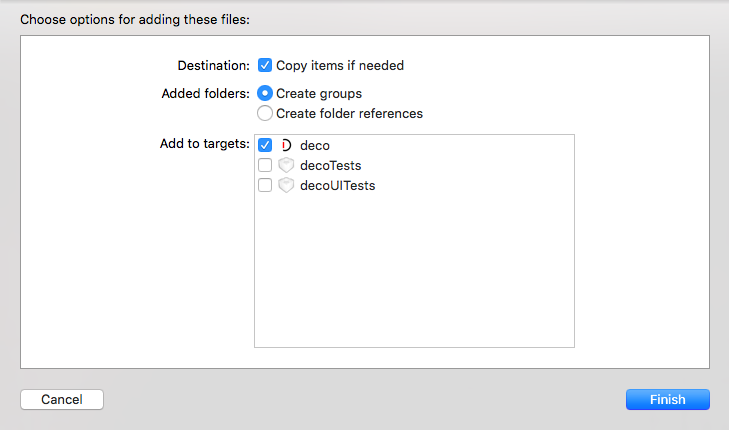

#deco_swift

#動作確認済み環境
- Mac OSX 10.11.2
- Xcode7.2
- iOS9.2

#インストール方法
## Macの場合
### Homebrewをインストール

```bash
$ /usr/bin/ruby -e "$(curl -fsSL https://raw.githubusercontent.com/Homebrew/install/master/install)"
```

### Homebrewからrbenvをインストール

ターミナルを起動し、以下のコマンドを入力します。

```bash
$ brew install rbenv
$ brew install ruby-build
```
ruby-buildのインストールの際に

```
this causes certain builds to fail on OS X El Capitan (10.11).
Please install the CLT via:
 sudo xcode-select --install
```

のような記述が出た際は

```
$ sudo xcode-select --install
```
を入力してください。
すると、

が出るので、インストールを押してください。

### rbenvのPATHを通します

```bash
$ echo 'export PATH="$HOME/.rbenv/bin:$PATH"' >> ~/.bash_profile
$ echo 'if which rbenv > /dev/null; then eval "$(rbenv init -)"; fi' >> ~/.bash_profile
$ source ~/.bash_profile
```

### PATHが通っているかを確認

```bash
$ rbenv -v
rbenv 0.4.0
```

とかになればOKです。

### rubyをインストール

```
rbenv install 2.3.0
結構時間かかります
```

バージョンはなるべく最新のものを入れてください。
インストールできるrubyのリストは

```
$ rbenv install -l
```

で確かめることができます。

###rubyを適用

```bash
$ rbenv global 2.3.0
先ほどダウンロードしたバージョンにしてください
$ ruby -v
2.3.0
```

となればOK

###cocoapodsをインストール


```bash
$ sudo gem update
Overwrite the executable?
と聞かれたら全てyと入力し、enterを押す。
$ sudo gem install cocoapods
```

###projectをクローンする

```bash
$ cd 任意のディレクトリ
$ git clone https://github.com/sugoiDECO/deco_swift.git
```

###podで管理されているライブラリをインストールする

```bash
$ cd deco_swift
$ pod install
```

###Xcodeでプロジェクトを開く



`deco.xcodeproj`ではなく、`deco.xcworkspace`を開きます。



開いた後、このような表示が出た場合にはConvertを押していただき、その後の画面でもConvertを押してください。


この欄のBundle Identifierを写真のように自分の名前など適当な値を入れて変えてください。



こちらの欄でTeamを自分のAppleIDに設定します。
初めて設定する際はAppleIDでログインする必要があるかもしれません。

###Build & Runする


- 自身のiPhoneを接続します。

画面左上のこの部分から自身のデバイスを選択します。

(こちらは初めてのデバイスだと結構時間がかかるかもしれません。)

- Runを押す。
読み込みが終わったら、三角形のRunボタンを押し、インストールします。


#JSONの設定方法
##JSONのフォーマット

```
{
    "52956:29906": {
        "id":"1",
        "title":"【A-1】出勤指示",
        "description":"災害対策本部より、災害状況の確認の要請がありました。大阪市立大学学友会館に設置された学内ボランティアセンターでチームを組み、街の状況及び安全なルート確認してください。確認でき次第、災害本部に報告をお願いします。",
        "actions": [
            "経路の確認",
            "報告",
            "DECOシール回収"
        ],
        "ways": [
            "カメラ",
            "Twitter",
            "デジタルマップ"
        ]
    },
    "27426:10315": {
        "id":"2",
        "title":"【A-2】状況確認要請",
        "description":"災害対策本部より、ヘリポートでの救援物資の確認と周辺被災状況の確認要請がありました。安全なルートで現地に向かい、至急状況を確認し、状況を災害対策本部に報告の上、指示を仰いでください。",
        "actions": [
            "報告",
            "経路確認",
            "DECOシール回収"
        ],
        "ways": [
            "Twitter",
            "カメラ"
        ]
    },
    "34433:43466": {
        "id":"3",
        "title":"【A-3】けが人搬送要請",
        "description":"杉本地区の住宅密集地の北側でけが人搬送要請がありました。安全なルートで現地に向かい、至急状況を確認し、けが人の様子を災害対策本部に報告の上、指示を仰いでください。ただし、住宅密集地区では火災発生状況のため、地区の迂回を検討してください。",
        "actions": [
            "応急処置",
            "報告",
            "経路の確認",
            "DECOシールの回収"
        ],
        "ways": [
            "救急セット",
            "カメラ",
            "Twitter"
        ]
    }    
}

```
以上のような形がフォーマットとなります。
順に説明していきます。
- "52956:29906"
こちらはEstimoteBeaconのIDになります。この後に続く内容はこのビーコンの発火に紐付けられます。

- "id"
idは１からスタートし、***必ず連番***で記入してください。（そうしないとアプリが途中でクラッシュします。）

- "title"
タイトルはタスク一覧画面に表示される内容です。

- "description"
こちらは詳細説明です。タスク詳細画面に表示されます。

- "actions"
こちらはタスク詳細画面のアクションの項目に追加されます。
カンマで区切ることで改行して表示されます。

- "ways"
こちらはタスク詳細画面の手段の項目に追加されます。
カンマで区切ることで改行して表示されます。

##保存場所と適用方法

###保存方法

Xcodeを開き、`deco/Model/`の中に`.json`ファイルを入れます。


`Copy Item if needed`の欄にチェックを入れ、Finishを押します。
これで保存が完了します。

### 適用方法

`AppDelegate.swift`を開き、１４６行目の

```swift
        let path : String = NSBundle.mainBundle().pathForResource("shimoda", ofType: "json")!
```
の欄の`"shimoda"`となっているところを適用したいjsonファイルの名前から`.json`を抜いた形にしてください。
例）　shimoda.jsonなら　shimoda

その後再びRunを押し、アプリをインストールします。
#操作方法
##トップ画面
初回起動時にBluetoothとGPSの使用の許可を求められると思いますが、許可を押してください。

- スタートボタン
	- スタートボタンを押すと、メインのタスク一覧画面に移る
- リセットボタン
	- リセットボタンはアプリに登録されているデータ（タスクの出現や完了など）を削除し、初期化します。


##タスク一覧画面
タスク一覧画面ではタスクをいくつ完了したか、何のタスクが出現しているか、タスクが完了しているかがわかる。


##タスク詳細画面
タスク詳細画面では実際にBeaconに近づいた際に現れるタスクの詳細、アクション、手段が見られます。実際にタスクを完了する際にはタスク完了のボタンをタップしてもらうとタスクが完了し、タスク一覧画面上でのそのタスクの文字が白くなり、完了の合図としてチェックマークがつきます。同時にサーバへは位置情報とともにタスク完了の通知が行くようになっています。


